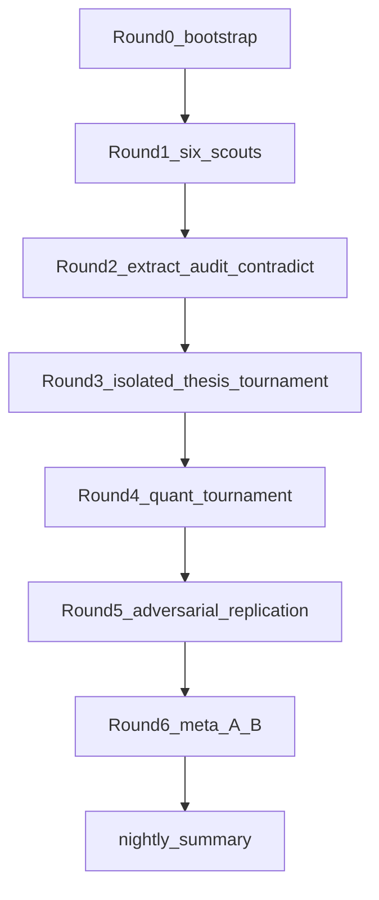

# Aptamer biosensor research swarm

**HISTORICAL bootstrap plan (Round 0–6 overnight).** The live Mission-2/3 vehicle is `cursor/m2-int-honesty-245a` (PR 32, draft); start at `reports/mission3_entry.md`. Todos below are the as-written bootstrap record, not current work.

## Plan-review gates (this revision)

The plan was reviewed against six execution gates. All six are required. Gaps found in the first draft are closed in this revision.

- Specialist agents: nine named files under [`.cursor/agents/`](.cursor/agents/). Created in Round 0, before any literature work.
- Evidence ledger: exact CSV/JSON/Markdown files listed below; empty schemas in Round 0; populated only after verification.
- Bounded meta-improvement: A/B patches only; stop after six meta rounds or two consecutive &lt;2 percentage-point gains; constitution/rubric/safety frozen.
- Isolated branches/worktrees: one swarm branch plus separate analysis worktrees; two writers never share a working tree.
- Nightly summary: [`reports/nightly_summary.md`](reports/nightly_summary.md) with all 13 sections; written last, from artifacts that already exist.
- No final poster: storyboards and thesis sentences only. No PowerPoint, Canva, Figma, Illustrator, print layout, or “finished poster PDF.” Do not start poster production even if earlier rounds finish early.

## What this run will and will not do

This execution will stand up the swarm, gather and verify literature, tournament theses and analyses, replicate the winners, and write [`reports/nightly_summary.md`](reports/nightly_summary.md).

**Forbidden in this run**

- A polished/final BIOC1600 poster (any format).
- Pixel layout, color systems, logo placement, or print-ready 90×120 cm artwork.
- Using Canva or Figma skills for the group poster.
- Treating `poster/storyboards/` as a license to design the poster.

**Allowed poster-facing artifacts (text only)**

- [`poster/theses.md`](poster/theses.md): best and runner-up one-sentence theses plus why one won.
- [`poster/storyboards/*.md`](poster/storyboards/): six-panel outlines (panel title, claim, evidence IDs, figure idea). No designed panels.
- Nightly section 8: the recommended storyboard copied from those markdown files.

The swarm will **test** the provisional question (can an aptamer keep up with neurochemical signaling?) and the candidate slogan (“aptamer quality is not a single number”). If verified evidence supports a sharper or different thesis, that thesis wins.

## Environment facts (already recorded; do not invent)

- Repo: [`https://github.com/bobshenruililin/BIOC1600-1`](https://github.com/bobshenruililin/BIOC1600-1), currently only [`README.md`](README.md) on `main`.
- This run’s model: **`cursor-grok-4.6-xhigh`** (`originalModelName` from cloud run metadata). User text mentioned “Grok 4.7”; that ID is **not** available. Do not invent `grok-4.7`.
- Usable Grok Task IDs: `cursor-grok-4.6-xhigh`, `cursor-grok-4.6-xhigh-fast`, `cursor-grok-4.6-high`, `cursor-grok-4.6-high-fast`, `cursor-grok-4.6-medium`, `cursor-grok-4.6-medium-fast`, `cursor-grok-4.6-low`, `cursor-grok-4.6-low-fast`.
- Default worker model: `cursor-grok-4.6-xhigh`. Use `-fast` variants only for high-volume extraction/merge.
- Egress is unrestricted. Literature access is **OA/PMC/Unpaywall/Europe PMC/Crossref/OpenAlex/PubMed only**. No paid APIs, no Sci-Hub, no copyrighted PDFs in Git.
- Course context (for Tanner alignment and poster constraints, not as a hidden rubric change): BIOC1600 is a first-year CI course coordinated by Prof. Julian A. Tanner; group communication is 30% of the grade; public poster guidance is a visual abstract ≤90×120 cm. Tanner-lab alignment means nucleic-acid recognition, interface/immobilization honesty, and not treating docking as proof.

## Git and isolation

Working branch: `cursor/research-swarm-634f` off `main`.

Additional isolated branches **and worktrees** when implementing or replicating analyses:

```bash
git worktree add ../wt-analysis-a -b cursor/analysis-<shortname-a>-634f
git worktree add ../wt-analysis-b -b cursor/analysis-<shortname-b>-634f
git worktree add ../wt-replicate-a cursor/analysis-<shortname-a>-634f
```

Round 4 implementations run in `wt-analysis-a` / `wt-analysis-b`. Round 5 replicators use **separate** worktrees (or a clean clone) and may not write into the implementer’s tree. Two writers never share a working tree.

Thesis-tournament agents (Round 3) are isolated by Task context (no shared candidate files). They return markdown; the orchestrator writes [`analysis/candidates/`](analysis/candidates/). They do not need worktrees unless they start editing the repo.

Commit and push after every completed round. Open/update one PR for the swarm branch; analysis branches get their own PRs if they contain runnable code.

Parallel **research/review** workers: readonly custom subagents; they return structured records; the orchestrator writes ledgers.

If a custom `.cursor/agents/` type is not yet registered in the Task tool after Round 0, fall back to `generalPurpose` with that agent’s prompt pasted verbatim and `model: cursor-grok-4.6-xhigh`.



## Round 0 — bootstrap (orchestrator writes; no science claims yet)

Create this tree (exact files, not “directories later”):

- [`AGENTS.md`](AGENTS.md) — swarm operating manual (roles, isolation, what workers may not change).
- [`.cursor/rules/research-constitution.mdc`](.cursor/rules/research-constitution.mdc) (`alwaysApply: true`) — claim tags, quantity vocabulary, no property transfer, computational = hypothesis unless experimentally validated.
- [`.cursor/rules/scoring-rubric.mdc`](.cursor/rules/scoring-rubric.mdc) (`alwaysApply: true`) — locked thesis and analysis scores. Meta-improver may not edit this file.
- [`.cursor/rules/safety-and-integrity.mdc`](.cursor/rules/safety-and-integrity.mdc) — no invented citations/numbers; no PDFs in Git; human approval for group-final thesis.
- Nine agent files, each with YAML frontmatter (`name`, `description`, `model: cursor-grok-4.6-xhigh`):
  - [`.cursor/agents/literature-scout.md`](.cursor/agents/literature-scout.md) `readonly: true`
  - [`.cursor/agents/evidence-extractor.md`](.cursor/agents/evidence-extractor.md) `readonly: true`
  - [`.cursor/agents/contradiction-hunter.md`](.cursor/agents/contradiction-hunter.md) `readonly: true`
  - [`.cursor/agents/citation-auditor.md`](.cursor/agents/citation-auditor.md) `readonly: true`
  - [`.cursor/agents/aptamer-biochemist.md`](.cursor/agents/aptamer-biochemist.md) `readonly: true`
  - [`.cursor/agents/sensor-engineer.md`](.cursor/agents/sensor-engineer.md) `readonly: true`
  - [`.cursor/agents/quant-modeler.md`](.cursor/agents/quant-modeler.md) `readonly: false`
  - [`.cursor/agents/poster-red-team.md`](.cursor/agents/poster-red-team.md) `readonly: true`
  - [`.cursor/agents/meta-improver.md`](.cursor/agents/meta-improver.md) `readonly: false` (writes only under `rounds/meta/`)
- Evidence ledger (headers + zero data rows, or JSON stubs):
  - [`state/sources.csv`](state/sources.csv)
  - [`state/claims.csv`](state/claims.csv)
  - [`state/scoreboard.json`](state/scoreboard.json)
  - [`state/open_questions.md`](state/open_questions.md)
  - [`state/decisions.md`](state/decisions.md)
  - [`research/evidence/core_evidence.csv`](research/evidence/core_evidence.csv) (created empty; filled in Round 2)
- Also create empty dirs with `.gitkeep` where needed: `research/scouts/`, `research/reviews/`, `analysis/candidates/`, `analysis/accepted/`, `poster/storyboards/`, `rounds/`, `scripts/`.
- [`poster/theses.md`](poster/theses.md) stub: “no thesis selected; Round 3 pending.”
- [`state/model_config.json`](state/model_config.json) — exact model IDs above plus this run URL.
- Hash lock: `state/LOCKED_FILES.sha256` covering constitution + scoring rubric + claim-tag enum. CI fails if those files change without an explicit human decision in [`state/decisions.md`](state/decisions.md).

Round 0 still promotes nothing to `core` and still produces no poster artwork.

Validation scripts (no paid deps; stdlib + pytest):

- `scripts/validate_ledgers.py` — CSV/JSON schemas, unique IDs, allowed claim tags, PMID/DOI regex, required quantity-type field, `full_text_inspected` enum, ban of blank numeric fields filled with guesses.
- `scripts/forbid_pdfs.py` — reject `*.pdf` in Git.
- `scripts/score_theses.py` — apply locked weights; reject &lt;75; finalist ≥85.
- `.github/workflows/validate.yml` — run validators on PR.

**Claim tags (only these):** `primary-source-supported` | `review-supported` | `computational illustration` | `hypothesis` | `proposed experiment` | `unresolved`.

**Quantity types (never collapse):** `Kd_molecular` | `kon` | `koff` | `EC50` | `sensor_LOD` | `analytical_working_range` | `signal_gain` | `response_time` | `measurement_time` | `biological_concentration_range`.

Promote nothing to `core` in Round 0.

## Custom agents (prompt contracts)

Each file under [`.cursor/agents/`](.cursor/agents/) will encode the constitution and **refuse to synthesize beyond role**.

1. `literature-scout` (readonly) — 8–15 candidates; DOI/PMID/title/year; why it matters for the assigned lane; `full_text_inspected`; no thesis synthesis.
2. `evidence-extractor` (readonly) — one paper → rows: system, construct, manipulation, comparator, quantity type, number, units, matrix, limitation, locator. Missing values = empty, never inferred.
3. `contradiction-hunter` (readonly) — assume the current thesis is wrong; prefer primary experiments.
4. `citation-auditor` (readonly) — re-fetch identifiers via PubMed/Crossref; check claim–paper fit; adversarial.
5. `aptamer-biochemist` (readonly) — SELEX, construct, folding, truncation, buffer, specificity.
6. `sensor-engineer` (readonly) — transduction, probe density, fouling, time resolution, in-vivo leap.
7. `quant-modeler` (writable, isolated tree) — transparent numpy/scipy models; label simulations; no docking-as-proof.
8. `poster-red-team` (readonly) — BIOC1600 assessor; three hardest oral questions.
9. `meta-improver` (writable only for prompt candidates under `rounds/meta/`) — may not touch constitution, rubric, safety, or evidence definitions.

## Round 1 — six parallel scouts

Spawn **six independent** `literature-scout` Tasks (`model: cursor-grok-4.6-xhigh`) with **no shared nomination list**:

- A. Glutamate aptamer discovery/characterization (lead: Wu et al. PMID 34783880 — **verify**, do not trust the abstract).
- B. Glutamate/neurotransmitter aptamer sensors (lead: multiplex microelectrode PMID 40992279 — **verify identifier**).
- C. E-AB kinetics and temporal resolution (leads: PMID 41231675 IPA kinetics; older IPA 2 ms work).
- D. Immobilization, probe density, interface (leads: Tanner 2026 tetrahedron optical-fiber PMID 41851736 / DOI 10.1186/s12951-026-04194-8 as **interface** evidence, not glutamate evidence; White/Plaxco packing-density literature).
- E. AI/ML and HT-SELEX (lead: InstructNA, *Nat Comput Sci* 2026, DOI 10.1038/s43588-026-00965-3, public code `zhimingzhang275/InstructNA` — GPU training is **out of scope**).
- F. Conventional/non-aptamer glutamate sensing (enzyme electrodes, FSCV, genetically encoded sensors) as biological-timescale comparators.

Also scout **limitation** papers on tertiary-structure prediction, docking, solution→surface transfer, and analytical→neurotransmission extrapolation.

Orchestrator merges into [`state/sources.csv`](state/sources.csv) (`status=candidate` only). Deduplicate by DOI then PMID. **No core promotion.**

Write [`rounds/01/scout_merge.md`](rounds/01/scout_merge.md). Commit/push.

## Round 2 — verification (the scientific bottleneck)

Select ~20–30 most relevant candidates by: glutamate or small-molecule E-AB relevance, primary vs review, full-text access, construct transparency.

For the **10 most important**, run **two independent extractors** (separate Task calls; neither sees the other). Disagreements → `unresolved` until auditor resolves or a third pass.

Then:

- `citation-auditor` on all identifiers and claim–source links.
- `contradiction-hunter` with an explicit anti-thesis brief (aptamers *cannot* keep up; LOD≠biology; truncation changes recognition; docking is decorative).
- `aptamer-biochemist` + `sensor-engineer` on the glutamate construct chain (parent SELEX aptamer vs truncated/surface-bound sensor).

Outputs:

- [`research/evidence/core_evidence.csv`](research/evidence/core_evidence.csv)
- [`research/reviews/citation_audit.md`](research/reviews/citation_audit.md)
- [`research/reviews/contradictions.md`](research/reviews/contradictions.md)
- Promote to [`state/claims.csv`](state/claims.csv) **only** when tag + locator + quantity type are clear.

**Load-bearing check (must inspect full text if OA):** Wu Capture-SELEX `1d04` solution affinity vs truncated `glu1` sensor LOD/range. Abstracts already *suggest* a µM Kd vs sub-pM LOD. That gap is a hypothesis until extractors+auditor agree. Do not transfer 1d04 Kd onto glu1.

Commit/push before Round 3.

## Round 3 — isolated thesis tournament

Launch **four isolated** thesis writers (parallel Tasks; no candidate files in their context). Each must use **only** verified claims and return:

- one-sentence thesis
- central biochemical mechanism
- three decisive experiments
- one critical limitation
- one computational contribution
- six-panel storyboard
- three likely assessor attacks

Then **two independent** `poster-red-team` reviewers score all four with locked weights:

- primary-evidence strength 25
- BIOC1600 biochemical depth 15
- critical insight 15
- reproducibility 15
- central-question relevance 10
- visual explanatory power 10
- Tanner intellectual alignment 5
- novelty without overclaiming 5

Discard &lt;75. Finalists ≥85. Record in [`state/scoreboard.json`](state/scoreboard.json) and [`analysis/candidates/`](analysis/candidates/). Best and runner-up go to [`poster/theses.md`](poster/theses.md) and [`poster/storyboards/`](poster/storyboards/).

If **no** candidate ≥75, keep the highest as `provisional` and say so in the nightly report. Do not force the slogan thesis.

## Round 4 — analysis tournament, then two implementations

At least six `quant-modeler` proposals, including the six required families. Score with the locked analysis rubric (relevance, assumptions, public data, no paid resources, reproducibility, visual value, first-year explainability, misleading-interpretation risk).

**Hard constraint:** InstructNA full training needs CUDA/`torch` — that fails the “no paid cloud compute / run here” test. Treat InstructNA as a **documented, hypothesis-generating** demo at most (read paper + public README; do not claim a trained model). Prefer a CPU `FASTAptamer`-style enrichment count on **public** HT-SELEX data, or a tiny sequence-similarity audit of published InstructNA sequences if those tables are OA.

**Do not** pick molecular docking as flagship because it looks good.

Implement the **top two** in isolated branches. Each must have README, deps, tests, provenance, figures, limitations, and a one-command rebuild (e.g. `python -m pytest && python -m analysis.run`).

Likely winners if evidence cooperates (not pre-selected):

1. Equal-Kd / different-kinetics Langmuir ODE vs synaptic/extracellular glutamate timescales (all curves labeled **simulation**).
2. Structured evidence atlas from `core_evidence.csv` (construct vs Kd vs LOD vs response time; empty cells stay empty).

Commit/push implementations **before** testing is declared done, then run tests.

## Round 5 — adversarial replication

One independent agent per winning analysis: clean checkout, docs only, rebuild, tests.

A **different** agent checks figure vs caption vs overclaim.

Unreproducible or overstated analyses are rejected in the scoreboard and must not appear as “completed” in the nightly report.

## Round 6 — bounded meta-improvement loop

This is a **capped inner loop**, not unbounded self-modification. It starts only after Rounds 1–5 have produced real failures.

Build [`rounds/meta/failure_taxonomy.md`](rounds/meta/failure_taxonomy.md) from observed failures only (Kd/LOD mix-ups, metadata mismatch, missing matrix, unitless plots, construct transfer, over-broad thesis).

For each proposed prompt/workflow patch:

1. Preserve the old file as `.cursor/agents/<name>.vN.md` (or `rounds/meta/archive/`).
2. Write the candidate as `rounds/meta/candidates/<name>.vN+1.md`.
3. Rerun **both** against the same frozen benchmark (extract Wu + one E-AB kinetics paper + one planted bogus claim).
4. Score with the **unchanged** rubric in [`.cursor/rules/scoring-rubric.mdc`](.cursor/rules/scoring-rubric.mdc).
5. Adopt into `.cursor/agents/` only if the candidate wins **and** there is no citation, reproducibility, or scientific-integrity regression.

**Stop the inner loop at the first of:** six meta rounds; two consecutive rounds with &lt;2 percentage-point aggregate gain; no remaining observed failure class.

Workers may not modify: scientific acceptance criteria; source-verification standards; scoring weights; safety rules; experimental vs computational definitions; human-approval requirements.

## Nightly handoff (required; last artifact, not a poster)

Write [`reports/nightly_summary.md`](reports/nightly_summary.md) only after Rounds 0–6 have run (or a round has a recorded blocker). Every section must be filled from files on disk. Do not list planned work as completed.

Required sections, in order:

1. Best current poster thesis.
2. Runner-up thesis and why it lost.
3. Top 10–15 verified primary sources.
4. Five most important scientific insights.
5. Three important contradictions/limitations.
6. Recommended flagship computational analysis.
7. Status of any implemented analyses and tests.
8. Proposed six-panel poster storyboard (text outline only).
9. Hardest five assessor questions.
10. Changes the swarm made to its own prompts and evidence that those changes improved performance.
11. Failures, unresolved uncertainties and blocked items.
12. Exact commit SHA.
13. Exact paths to the core evidence table, analysis outputs and figures.

Also preserve: [`state/scoreboard.json`](state/scoreboard.json), [`state/sources.csv`](state/sources.csv), [`state/claims.csv`](state/claims.csv), [`research/evidence/core_evidence.csv`](research/evidence/core_evidence.csv), [`research/reviews/citation_audit.md`](research/reviews/citation_audit.md), [`research/reviews/contradictions.md`](research/reviews/contradictions.md), [`analysis/`](analysis/), [`poster/storyboards/`](poster/storyboards/).

Section 8 is a storyboard, not permission to design the poster.

## Scientific posture for workers

Starting PMIDs/DOIs are **leads**. Identifier 40992279 in particular must be re-fetched; if Crossref/PubMed disagree, mark `unresolved` and find the intended multiplex microelectrode paper by title/authors.

Tanner 2026 tetrahedron work is **N-protein optical fiber**, not glutamate. It may inform immobilization/interface claims only.

Glutamate biology numbers (synaptic cleft vs extrasynaptic vs blood) need primary neurochemistry sources, tagged separately from sensor LOD.

## Orchestrator discipline

- Maximum verified insight per poster **storyboard panel**, not maximum files and not a designed poster.
- After each round: validate ledgers, commit, push, update PR.
- Human approval remains required before any thesis is “group-final” ([`state/decisions.md`](state/decisions.md)).
- If tempted to “just mock up the poster because the thesis is clear,” stop. Write or update the nightly summary instead.
